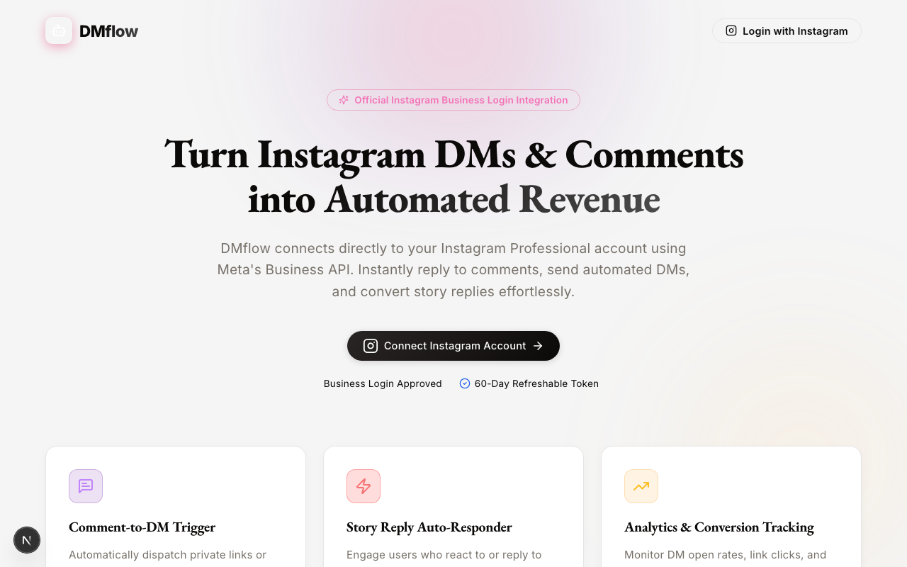
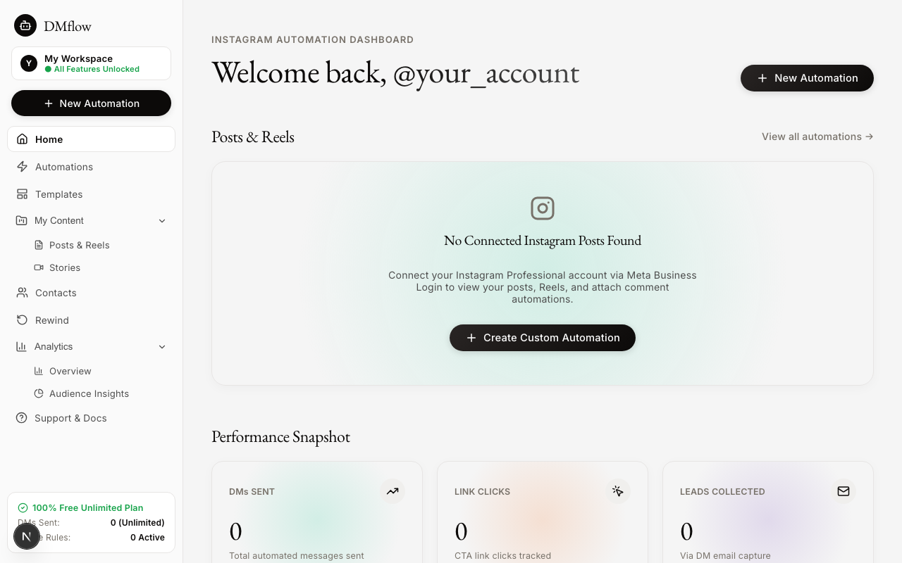
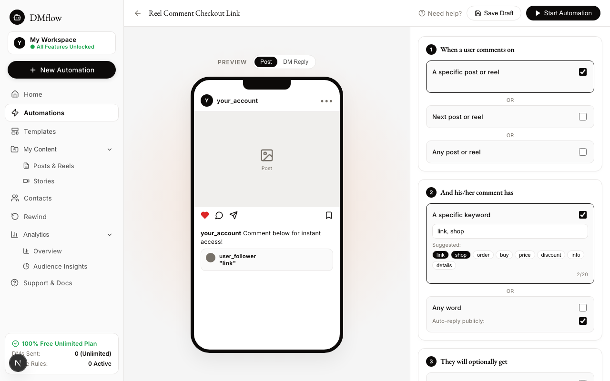
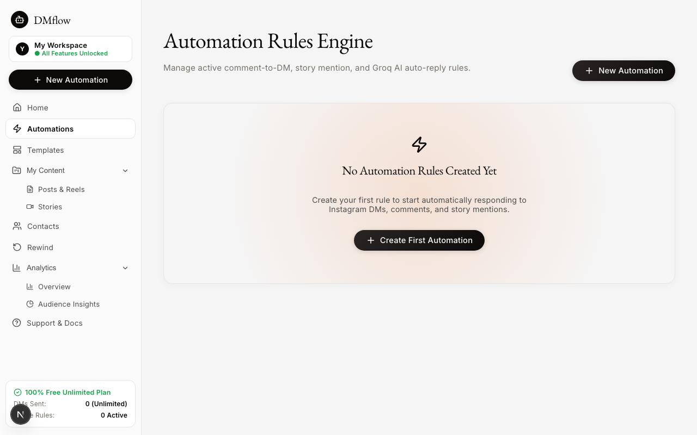
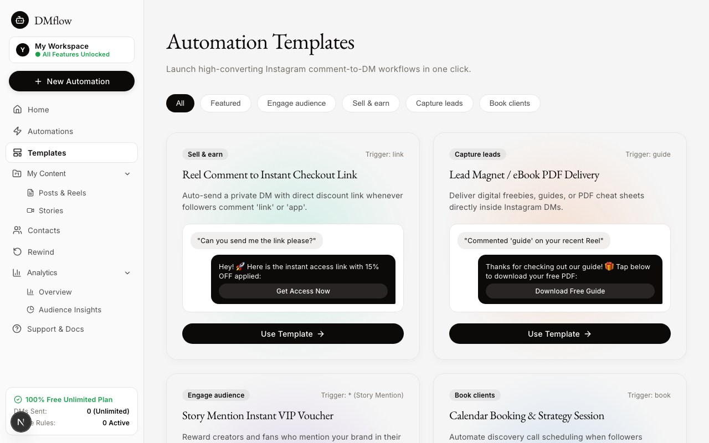
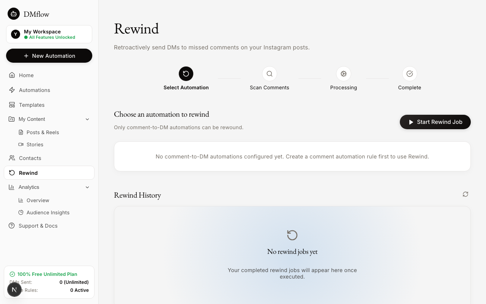
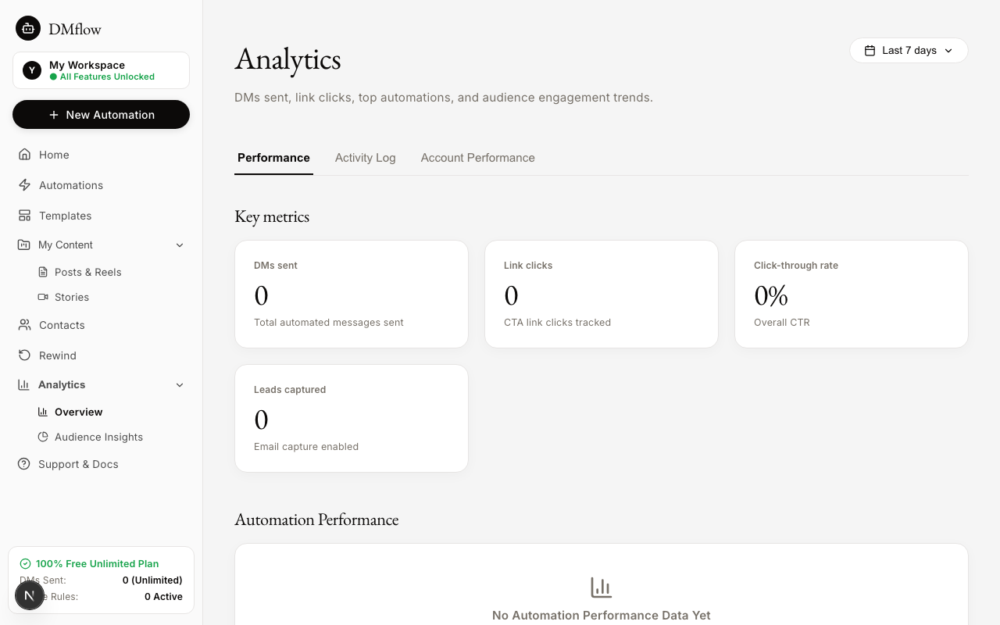
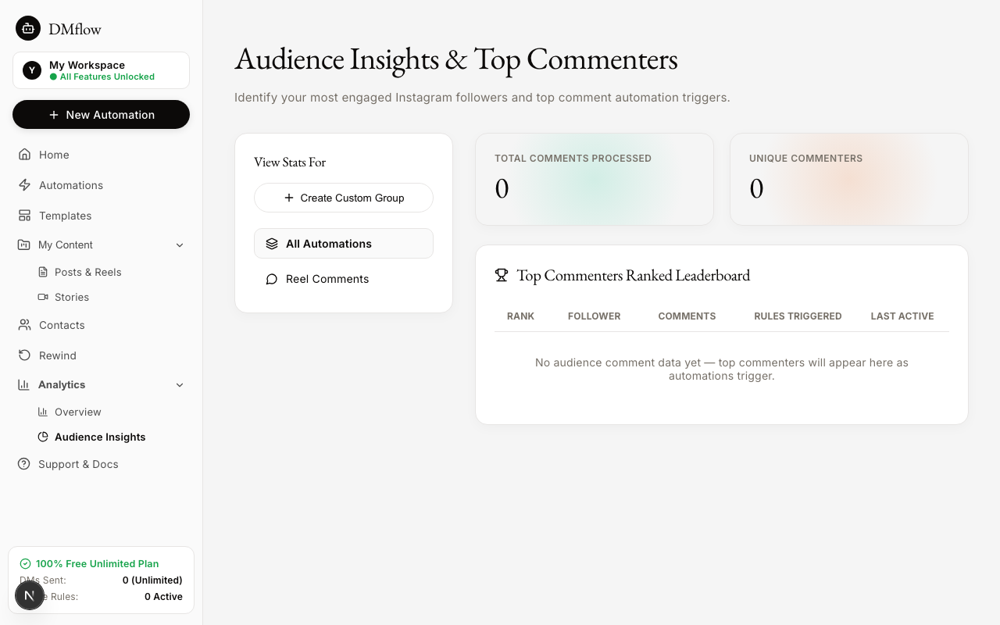
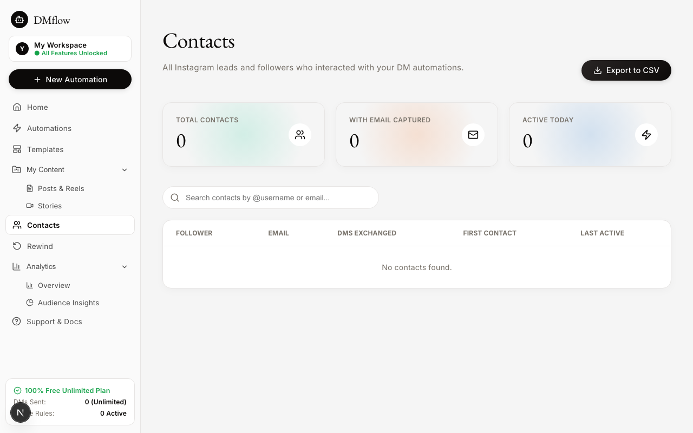

# Dakota 🚀
> Next-Generation Instagram Professional Automation & AI Auto-Reply Platform (100% Free & Unlimited)

Dakota is a full-featured Instagram Direct Message, comment-to-DM, story mention, and AI-powered auto-reply SaaS built with **Next.js 15**, **TypeScript**, **Supabase**, and **Groq Llama 3.1 AI**.

Inspired by ElevenLabs' quietly editorial print magazine design system (off-white canvas, warm near-black ink, soft atmospheric pastel gradient orbs), Dakota combines visual elegance with high-performance automation.

---

## 📸 Screenshots

### 1. Landing Page & Meta Business Connection


### 2. Analytics & Performance Dashboard


### 3. Centerpiece Automation Builder (Live Mobile Preview)


### 4. Automation Rules Engine & Status Management


---

## 📸 More Screenshots

### 5. One-Click Automation Templates Gallery
Pre-built high-converting comment-to-DM, story mention, and lead magnet delivery templates.


### 6. Retroactive Comment Rewind Engine
4-step visual tracker to retroactively dispatch DMs to past comments on your posts.


### 7. Performance & Range Analytics
Detailed metrics, CTR charts, and date-range performance breakdowns.


### 8. Audience Insights & Top Commenters
Ranked leaderboard of your most engaged Instagram followers and comment triggers.


### 9. Lead Contacts Directory & CSV Export
Centralized lead management storing handles, captured emails, and DM interaction stats.


---

## ✨ Features

- **⚡ Centerpiece Automation Builder**:
  - **Step 1**: Target specific Instagram posts/reels or trigger on any post.
  - **Step 2**: Match specific comment keywords (`link`, `shop`, `discount`, etc.) or trigger on any word.
  - **Step 3**: Optional actions — Opening DM (with custom button text), Follow-gate requirement, and Email Capture.
  - **Step 4**: Custom DM response with character limits, CTA buttons, and interactive modal link editor.
  - **Live iPhone Frame Mockup**: Real-time rendering of post comments and direct message thread bubbles.

- **🤖 Groq Llama 3.1 AI Auto-Reply Engine**:
  - Contextual AI auto-replies for unmatched comments or DMs using custom brand voice context and Groq's fast AI model.
  - Automatic fallback guardrails for response length and API timeouts.

- **📊 Comprehensive Analytics & Insights**:
  - Track DMs sent, CTA link clicks, CTR%, and total leads collected.
  - Interactive charts, top commenters leaderboard, and audience segment insights.

- **📁 Contacts Management**:
  - Lead contact directory storing usernames, captured emails, and DM interaction stats.
  - One-click CSV export functionality.

- **💎 100% Free & Unlimited**:
  - Zero paywalls, zero locked features, and no hard DM limits.

---

## 🛠️ Tech Stack

- **Framework**: Next.js 15 (App Router, Server Actions)
- **Language**: TypeScript
- **Styling**: Modern CSS variables & ElevenLabs Quietly Editorial Design System
- **Database**: Supabase (PostgreSQL, Row Level Security)
- **AI**: Groq SDK (`llama-3.1-8b-instant`)
- **Icons**: Lucide React

---

## What You Need to Use This App

A short list of free accounts and tools required before getting started:

- **A Supabase account (free)** — for database storage ([supabase.com](https://supabase.com))
- **A Meta Developer account (free)** — for Instagram Graph API & Business Login ([developers.facebook.com](https://developers.facebook.com))
- **A Groq account (free)** — for AI auto-replies (optional but recommended) ([console.groq.com](https://console.groq.com))
- **[Node.js](https://nodejs.org/) installed on your computer** (v18 or higher)
- **Basic comfort using a terminal** to run a few simple commands

---

## Running It Locally (For Testing/Development)

Follow these step-by-step instructions in order to run DMflow locally on your computer:

1. **Clone the repository**:
   ```bash
   git clone https://github.com/Ganeshp000/DMflow.git && cd DMflow
   ```

2. **Install dependencies**:
   ```bash
   npm install
   ```

3. **Copy environment file**:
   ```bash
   cp .env.example .env.local
   ```

4. **Set up Supabase Database**:
   - Create a free Supabase project at [supabase.com](https://supabase.com).
   - Go to **Project Settings → API**.
   - Copy your **Project URL**, **anon public key**, and **service_role key**.
   - Paste them into `.env.local`:
     ```env
     NEXT_PUBLIC_SUPABASE_URL=https://your-project.supabase.co
     NEXT_PUBLIC_SUPABASE_ANON_KEY=your-anon-key
     SUPABASE_SERVICE_ROLE_KEY=your-service-role-key
     ```

5. **Run the Database Schema**:
   - In your Supabase Dashboard, open the **SQL Editor**.
   - Copy and run the SQL code from [`supabase/schema.sql`](./supabase/schema.sql) to set up all tables and security policies.

6. **Create Meta Developer App**:
   - Go to [developers.facebook.com](https://developers.facebook.com) and click **Create App**.
   - Select product **Instagram** → choose **Instagram API with Instagram Login** (Business Login, NOT Facebook Login or Basic Display).
   - Copy your **Instagram App ID** and **App Secret**.
   - Paste them into `.env.local`:
     ```env
     NEXT_PUBLIC_INSTAGRAM_APP_ID=your_app_id
     INSTAGRAM_APP_ID=your_app_id
     INSTAGRAM_APP_SECRET=your_app_secret
     INSTAGRAM_WEBHOOK_VERIFY_TOKEN=your_custom_secret_token
     ```

7. **Configure OAuth Redirect URI**:
   - In Meta App Settings → Instagram Business Login Settings, add your local redirect URI:
     `http://localhost:3000/api/auth/callback`

8. **Add Groq AI Key (Optional)**:
   - Create a free key at [console.groq.com](https://console.groq.com).
   - Paste it into `.env.local`:
     ```env
     GROQ_API_KEY=gsk_your_groq_key
     ```

9. **Run the Development Server**:
   ```bash
   npm run dev
   ```
   Open [http://localhost:3000](http://localhost:3000) in your browser.

10. **Testing Webhooks Locally**:
    - To receive real Instagram webhook events (comments/DMs/mentions) while running locally, you need a tunnel tool since Instagram cannot reach `localhost` directly:
      - Install **[ngrok](https://ngrok.com/)** (or use Cloudflare Tunnel).
      - Run `ngrok http 3000` and copy the `https://...` URL it generates.
      - Set that URL + `/api/webhook/instagram` (e.g., `https://your-tunnel.ngrok-free.app/api/webhook/instagram`) as your **Webhook Callback URL** in Meta Developer App.
      - Set your chosen **Webhook Verify Token** in both the Meta app dashboard and `INSTAGRAM_WEBHOOK_VERIFY_TOKEN` in `.env.local`.
      - *Note: Free ngrok URLs change on every restart, so you'll need to update the Meta app's Webhook Callback URL whenever you restart ngrok.*

---

## Deploying It for Real (So It Runs 24/7, No Laptop Needed)

Follow these steps to deploy DMflow to a permanent cloud host:

1. **Push code to GitHub**:
   - Push your code to your own GitHub repository (fork this repository or use your clone).

2. **Connect to Vercel**:
   - Create a free account at [vercel.com](https://vercel.com).
   - Click **Add New Project** and import your GitHub repository.

3. **Configure Environment Variables in Vercel**:
   - In Vercel's Project Settings → Environment Variables, add all the variables from your `.env.local` file (Supabase keys, Instagram App ID/Secret, Groq key, Webhook verify token).

4. **Deploy**:
   - Click **Deploy**. Vercel will build the project and provide a permanent live URL like `your-app.vercel.app`.

5. **Update Meta App URLs**:
   - Return to your Meta Developer App Dashboard and update:
     - **OAuth Redirect URI** → `https://your-app.vercel.app/api/auth/callback`
     - **Webhook Callback URL** → `https://your-app.vercel.app/api/webhook/instagram`
   - *(This replaces ngrok — no tunnel needed and no URL changes on restart!)*

6. **Custom Domain (Optional)**:
   - If you add a custom domain in Vercel (e.g. `yourdomain.com`), update the Meta App Redirect URI and Webhook Callback URL to use your custom domain.

7. **Meta App Review & Production Mode**:
   - While your Meta App is in **Development Mode**, only Instagram accounts added as Testers/Admins in your Meta App Dashboard can log in and automate DMs.
   - To allow the general public to connect their own Instagram accounts to your hosted instance, submit your app for **Meta App Review** (requires a public privacy policy URL and permission request justification).
   *Note: App Review is completely optional if you are running DMflow for your own personal accounts or team.*

---

## ⚖️ Responsible Use

DMflow automates Instagram DM and comment replies via the official Meta Graph API. Please use it responsibly:

- **Respect Instagram's rate limits.** The Instagram Messaging API has platform-enforced rate limits (typically ~200 API calls per user per hour). DMflow does not override or bypass these. If you hit a rate limit, the API will return an error and DMflow will log it honestly as a failed send.
- **Only automate accounts you own.** The OAuth flow ensures you can only connect your own Instagram Business or Creator accounts.
- **Don't use this for spam.** Sending unsolicited bulk messages violates Instagram's Terms of Service and can get your account restricted or banned. DMflow is designed for responding to people who engage with your content first (comments, DMs, story mentions).
- **Review Meta's Platform Terms** at [developers.facebook.com/terms](https://developers.facebook.com/terms/) before deploying to production.

---

## 📄 License

MIT License © 2026 DMflow — see [LICENSE](./LICENSE) for full text.
